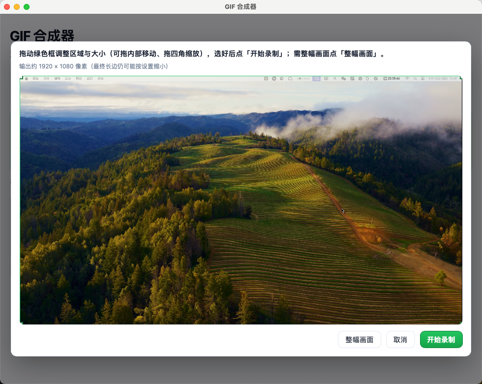

# GIF 合成器

基于 **Tauri 2 + Vite + TypeScript** 的桌面应用：在 **macOS** 与 **Windows** 上功能一致，可将多张图片按顺序合成 GIF，支持拖拽调整顺序并保存到本地。

## 截图




## 功能

- 选择多张本地图片（PNG / JPEG / GIF / WebP / BMP）
- 列表支持 **拖拽排序**，也可用「上移 / 下移」微调
- 设置 **每帧间隔（毫秒）**，循环播放
- 画布尺寸以 **第一张图** 为基准，其余图片按比例缩放并居中铺在白底上
- 通过系统对话框 **选择保存路径** 导出 `.gif`
- **录屏转 GIF**（`getDisplayMedia`）：系统共享后可在应用内**框选区域与大小**（或一键整幅画面）；最长 60 秒、无水印

## 环境要求

- **Node.js** 18+
- **Rust / Cargo**（必须通过 rustup 安装，Tauri 依赖 `cargo`）  
  - macOS：先装 [Xcode Command Line Tools](https://developer.apple.com/xcode/resources/)：`xcode-select --install`  
  - Windows：安装 [Visual Studio Build Tools](https://visualstudio.microsoft.com/visual-cpp-build-tools/)（含 MSVC）与 WebView2

### 安装 Rust（macOS / Linux 示例）

```bash
curl --proto '=https' --tlsv1.2 -sSf https://sh.rustup.rs | sh
# 安装完成后按提示执行 source，或重新打开终端
source "$HOME/.cargo/env"
cargo --version
```

若已安装但仍提示找不到 `cargo`，多半是 **PATH 未包含 `~/.cargo/bin`**。在 `~/.zshrc` 末尾追加：

```bash
export PATH="$HOME/.cargo/bin:$PATH"
```

保存后执行 `source ~/.zshrc`，**完全退出并重新打开 Cursor** 再运行 `npm run tauri dev`。

## Pro 能力

当前默认即 Pro：合成张数不限制，录屏最长 60 秒且无水印。工具栏会显示当前 Pro 徽章。

## 开发调试

```bash
cd gif-composer
npm install
npm run tauri dev
```

## 打包

- **当前系统直接打包**（推荐）：

```bash
npm run tauri build
```

产物目录：`src-tauri/target/release/bundle/`  
- macOS：`.app` / `.dmg`  
- Windows：`.msi` / `.exe`（依工具链与配置而定）

Release 页上的 **Source code (zip/tar.gz)** 是 GitHub 为每个 tag **自动附加的源码包**，不是安装包；**安装包**来自 CI（`tauri build`）上传到 **Assets** 后才会多出来 `.dmg`、`*-setup.exe`（NSIS）等。**若 Assets 里仍只有两个压缩包，请到 Actions 打开本次 tag 触发的 workflow**，看 Windows / macOS 是否报错；常见原因是 `targets: all` 在 Windows 上编 `.msi` 需要 **WiX**，GitHub 默认环境缺它会导致整次构建失败、从而没有 exe/dmg。

- **交叉编译**（可选，需自行配置对应 linker / SDK）本文不展开。

- **GitHub：打 tag 自动打包**：推送形如 `v0.1.0` 的 tag 会触发仓库内 `.github/workflows/release-tag.yml`，在 Windows / macOS Runner 上构建并将安装包上传到 **同名 GitHub Release**。需先将 **含 `src-tauri` 的可构建工程** 与 **工作流文件** 提交并推到默认分支，再打 tag；若此前已打过 tag，可删远端 tag 后重新推送，或在修正后推新版本 tag（例如 `v0.0.2`）。

## macOS：提示「已损坏，无法打开」

若系统弹出类似提示：**「"gif-composer.app"已损坏，无法打开。你应该将它移到废纸篓」**，多半是 **Gatekeeper / 隔离属性**（从网上下载的未签名应用），**不等于**安装包真的坏了。

**推荐做法（在信任该应用来源的前提下）：**

1. 打开 **终端**（例如：启动台 → **「终端」**）。
2. 若已将 **`gif-composer.app`** 放进系统的 **「应用程序」** 文件夹，默认路径即为 **`/Applications/gif-composer.app`**。在终端里 **粘贴下面整行**，按 **回车** 执行：

```bash
xattr -cr "/Applications/gif-composer.app"
```

3. 命令执行后若无报错，**关掉旧提示窗**，从启动台或「应用程序」里 **重新打开** gif-composer 即可。

若 `.app` 还在 **下载**、**桌面** 等位置，请把引号里的路径改成实际路径，例如：

```bash
xattr -cr "$HOME/Downloads/gif-composer.app"
```

也可在 Finder 中对 **`gif-composer.app`** **右键 →「打开」→「打开」** 作为替代方式。要彻底避免该提示，需使用 Apple 开发者账号做 **代码签名与公证**（公开发布场景）。

## 图标

项目已包含 `src-tauri/icons` 下的 PNG。若需替换品牌图标，可将一张 **1024×1024** 主图放到仓库根目录后执行：

```bash
npx tauri icon ./your-icon.png
```

## 说明

- GIF 每帧颜色数经量化（`imagequant`），体积与观感会有折中。
- 若缩略图预览异常，请确认 `tauri.conf.json` 里 `app.security.assetProtocol` 已启用且 `scope` 覆盖所选文件路径（示例中为 `["**"]`，仅适合自用/内部工具）。
- **Pro · 录屏转 GIF**：依赖 `getDisplayMedia`。**macOS** 的 `src-tauri/Info.plist` 需同时包含 `NSScreenCaptureUsageDescription`、`NSCameraUsageDescription`、`NSMicrophoneUsageDescription`：仅声明屏幕录制时，部分系统上 **WebKit 不会挂载 `navigator.mediaDevices`**（与 [Tauri #4677](https://github.com/tauri-apps/tauri/issues/4677) 类似）；摄像头与麦克风可在系统弹窗中选「不允许」。另需在「隐私与安全性 → 录屏与系统录音」中允许本应用。**Windows** 需 WebView2；**Linux** 需 WebKitGTK 与桌面门户。录屏最长 60 秒、无水印。
